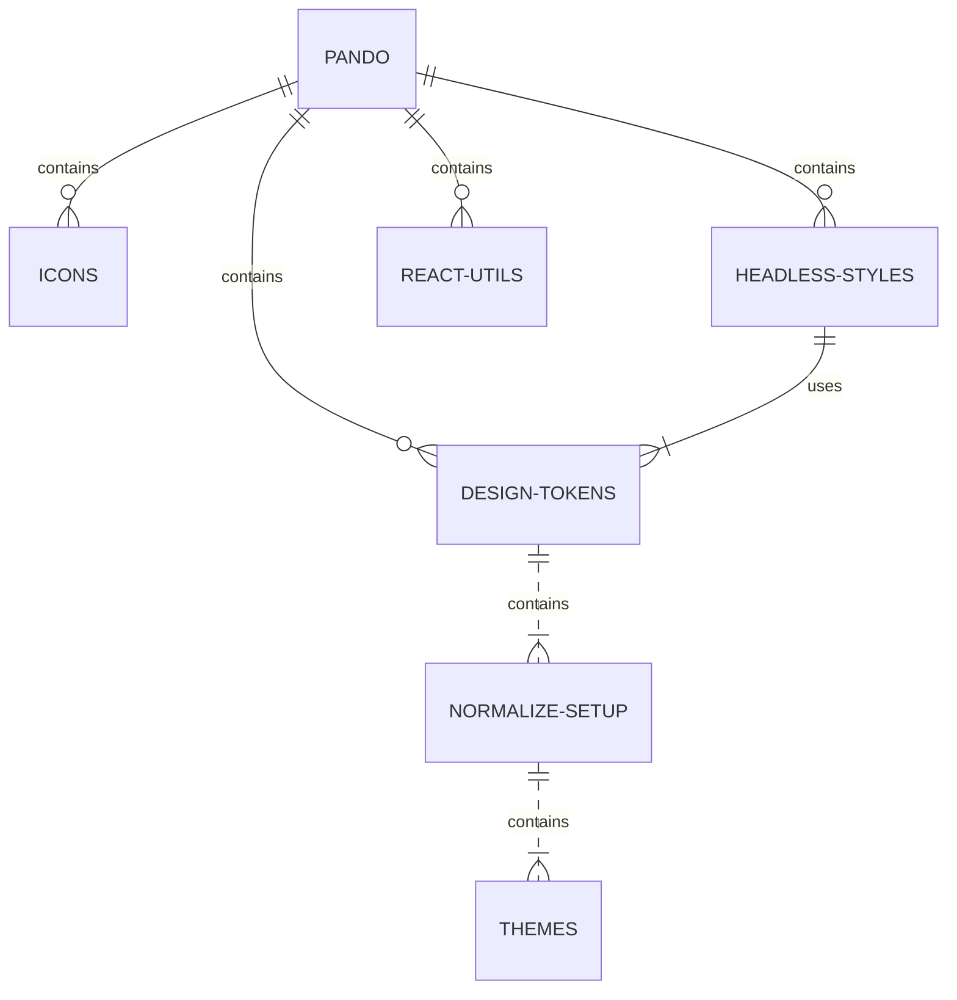

# Design Tokens

The foundation package to the Pando ecosystem which creates design tokens for all platforms using [style dictionary](https://amzn.github.io/style-dictionary/#/).

## What role does this package play in Pando?



Despite this being one of the simplist packages (SCSS & YAML), it plays a foundational role in the entire Pando ecosystem.

### Design Tokens General Function

The design-tokens package owns all the themes available from Pando via the [tokens/base](https://github.com/pluralsight/pando/tree/main/packages/design-tokens/tokens/base) directory. This folder ultimately runs through our custom Style Dictionary config for both web and mobile to produce our [themes and Web Meta](https://design.pluralsight.com/docs/next/development/tokens/intro#usage).

### Normalize Setup within Design Tokens

Additionally, the design-tokens package owns the [Fonts & Normalize Setup](https://design.pluralsight.com/docs/next/development/getting-started/installation#ps-tt-commons-font). This process is separate from tokens and use SASS to pre-proces the [entry file](https://github.com/pluralsight/pando/blob/main/packages/design-tokens/normalize.scss).

#### Themes within Normalize

We also generate our [Themes](https://design.pluralsight.com/docs/next/development/tokens/colors#list-of-tokens) from the Normalize pre-processing which allows us to combine the power of both SASS and Style Dictionary. This allows us to both establish and set a default theme as a fallback via CSS so there is no need for unneccessary Javascript/Typescript logic to do the same.

## Quick Start

To get the project up an running, all you need to do is make sure your deps are installed for this workspace.

In the **project root** (not this workspace), run

```bash
yarn install
```

This will setup all workspaces in this repo in addition to install all the deps
needed to successfully use this workspace.

### There is no dev environment

With style-dictionary, you are just creating static Yaml files, so there is no dev server or anything to run while adding tokens. However, we _highly recommend_ you make sure all extensions
that are [recommended]('../../.vsode/extensions.json) are installed in order to prevent triggering errors in our CI process.

## Project Structure

There are two types of tokens to create: private or public.

### Base Tokens

These our all of the projects private tokens and single source of truth for each custom theme value (i.e. light, dark, flow-dark, etc.). Everything inside here will get filtered out during the build process. Private tokens are only meant to be used as reference items for public tokens.

### Creating public tokens

Public tokens are the [semantic tokens](https://design.pluralsight.com/development/packages/tokens/intro#naming-convention) we ship to each team/product within Pluralsight. Therefore, it should rarely be updated or added to unless there is a new branding color/theme change.

This is to help keep all of our teams apps as performant as possible since the quanity and _usage_ of tokens **can make a negative impact** in browsers.

### Updating custom themes

If a theme needs to be updated (i.e. light, dark, flow-dark, etc.), all you need to do is edit the `value` in the `tokens/base/<file>.yaml` location. However, due to the custom tooling we are using, there are a few rules to consider:

- **DO NOT EDIT ANYTHING IN THE PUBLIC DIRECTORY**. These values source all the base tokens and should never be altered.
- **DO NOT CHANGE PROJECT STRUCTURE OR FILE NAMES**. We use a strict and complex filtering sytems that depends on both of these to be consistent.

Our base directory uses a file system that matches the PS Brand Theme color guide to help keep all of our themes consistent. For all themes, the "accent" correlates to the "default" semantic tokens.

## Testing your updates

To test your updates, run the build command for this workspace in the project root (not this workspace).

```bash
yarn workspace @pluralsight/design-tokens run build
```

You should see something like this output:

```
Copying files...

Source style dictionary files created!

Running `style-dictionary build` to generate build artifacts.

js
✔︎ build/index.js

css
✔︎ build/css/variables.css

scss
✔︎ build/scss/_variables.scss

android
✔︎ build/android/font_dimens.xml
✔︎ build/android/colors.xml

ios
✔︎ build/ios/StyleDictionaryColor.h
✔︎ build/ios/StyleDictionaryColor.m
No properties for StyleDictionarySize.h. File not created.
No properties for StyleDictionarySize.m. File not created.

ios-swift
✔︎ build/ios-swift/StyleDictionary.swift

ios-swift-separate-enums
✔︎ build/ios-swift/StyleDictionaryColor.swift
No properties for StyleDictionarySize.swift. File not created.
```

Depending on which platform you are testing, just reference the build file created.
