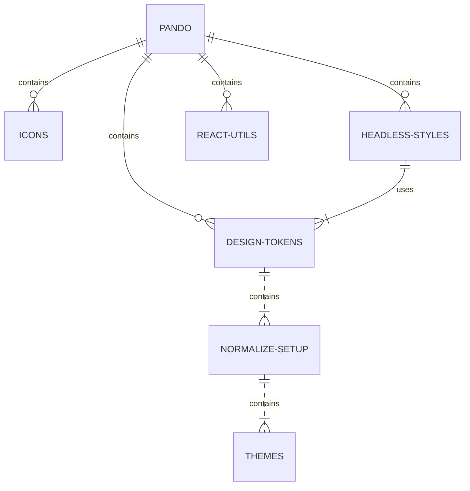

# Headless Styles

A functional helper library that delivers styles and a11y properties for the [Pluralsight Web UI Kit](https://www.figma.com/file/ZmH4XsZS5WnKeo28ylM5x1/PS-Design---Web-UI-Kit-%5BALPHA%5D?node-id=1215%3A51428) to be used in any Component library (framework agnostic).

- [Checkout the docs](https://pluralsight.github.io/pando/docs/development/getting-started/installation)

## What role does this package play in Pando?



This package allows users to build accessbile and performant components without worrying about the "small stuff": styling the UI.

### Headless Styles General Function

The headless-styles package relies on the use of the [Font & Normalize Setup](https://design.pluralsight.com/docs/next/development/getting-started/installation) provided from the [design-tokens package](https://github.com/pluralsight/pando/tree/main/packages/design-tokens).

Ultimately, headless-styles is just a library that is a bunch of functions that return Objects. Nothing more, nothing less. These functions return styles via classes (CSS) or style Objects (CSS-in-JS) and a11y attributes.

_⚠️ Headless-styles does and should not own advanced logic for components. At the base level, this library is meant to own presentational responsibilities. For advanced component logic (i.e state management, etc.), see [react-utils](https://github.com/pluralsight/pando/tree/main/packages/react-utils)._

## Install

This project uses Yarn 3 with PnP so there are no setup commands needed. If you get any errors, you may need to run an initial `yarn install` or esnure you are using Node >= 18.

## Development

Headless-styles uses an internal [sandbox](https://github.com/pluralsight/pando/tree/main/packages/headless-styles/sandbox) which auto-generates the CSS-in-JS styles used in our JS related API's.

From the **root directory of the project**, run:

```bash
yarn start:sandbox
```

## Testing

From the **root directory of the project**, run:

```bash
yarn test
```

## Contribution

If you plan on contributing to this project, please take time to read our [CONTRIBUTING.md](https://github.com/pluralsight/pando/blob/main/CONTRIBUTING.md). Pull requests that do not adhere to the requirements in this doc will automatically be flagged and closed.
