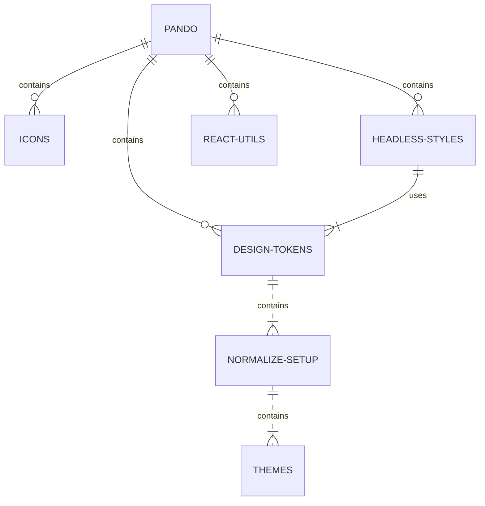

# Pluralsight Icons

A library of SVG icons and React/Svelte components.

- [Checkout the docs](https://pluralsight.github.io/pando/docs/development/icons/intro)

## What role does this package play in Pando?



This package produces pure icons solutions to be used in different ways (i.e. SVG or components) and is decoupled from all other packages.

### Icons General Function

The icons package is purely a Node utility that generates different icon types from initial [svg files](https://github.com/pluralsight/pando/tree/main/packages/icons/src).

## Install

This project uses Yarn 3 with PnP so there is no setup commands needed. Just clone the repo and start working. :tada:

## Development

There is no development environment for this package.

## Testing

To run your unit tests, make sure you are in the **project root directory** not this workspace - and run:

```bash
yarn test
```

## Contribution

If you plan on contributing to this project, please take time to read our [CONTRIBUTING.md](https://github.com/pluralsight/pando/blob/main/CONTRIBUTING.md). Pull requests that do not adhere to the requirements in this doc will automatically be flagged and closed.
