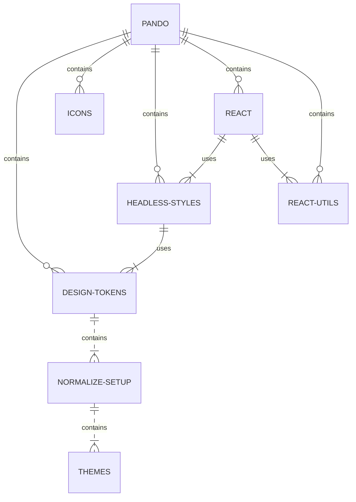

# React

A library of React components and hooks that help manage advanced React features like State and accessibility.

## What role does this package play in Pando?



This package utilizes the latest version of React to deliver component-based abstractions, helpers, and hooks of the Headless-styles library.

### React General Function

The react package is dependant on the Headless-styles library, and works cohesively with the other libraries when combined with them. It's true purpose is to provide a component and hook library within the Pando Normalize system (i.e. themes, etc.).

## Install

This project uses Yarn 3 with PnP so there are no setup commands needed. If you get any errors, you may need to run an initial `yarn install` or ensure you are using Node >= 18.

## Development

We utilize a Vite TS/React sandbox to help keep security issues, complexity, and dependency size down which is a common problem when using a tool like Storybook.

From the **root directory of the project**, run:

```bash
yarn start:react-sandbox
```

## Testing

To run your unit tests, make sure you are in the **project root directory** not this workspace - and run:

```bash
yarn test
```

## Contribution

If you plan on contributing to this project, please take time to read our [CONTRIBUTING.md](https://github.com/pluralsight/pando/blob/main/CONTRIBUTING.md). Pull requests that do not adhere to the requirements in this doc will automatically be flagged and closed.
