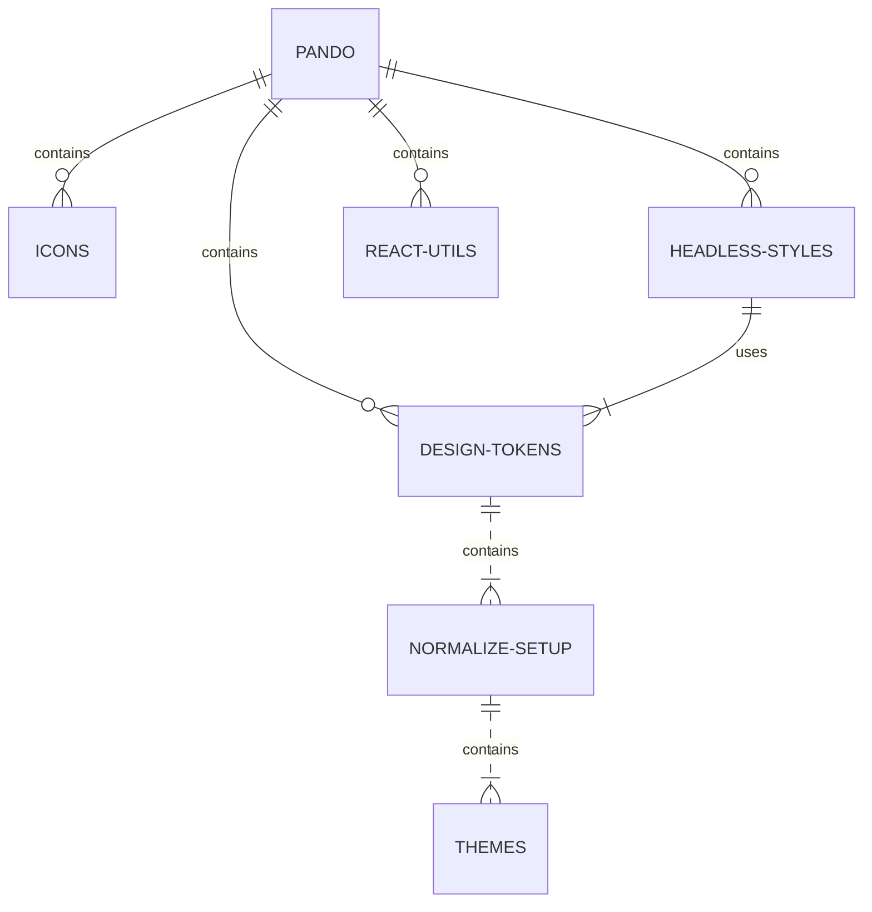

# React

A library of custom React hooks that help manage advanced React features like State and accessbility.

- [Checkout the docs](design.pluralsight.com/development/react-utils)

## What role does this package play in Pando?



This package utilizes the latest version of React to export custom hooks to use along with [Headless Styles](https://design.pluralsight.com/docs/next/development/headless-styles/intro) or independently from Pando.

### React Utils General Function

The react-utils package is independant from the Pando sister libraries, but works cohesively when combined with them. It's true purpose is to provide custom hooks that successfully work along side Headless Styles within the Pando Normalize system (i.e. themes, etc.).

However, most if not all custom hooks should work successfully outside of Pando due to the nature of its design.

## Install

This project uses Yarn 3 with PnP so there are no setup commands needed. If you get any errors, you may need to run an initial `yarn install` or esnure you are using Node >= 18.

## Development

There is no development sandbox for this specific project, but most of the time, we import the hooks into the [Headless Styles sandbox](https://github.com/pluralsight/pando/tree/main/packages/headless-styles/sandbox) which is [just as easy](https://github.com/pluralsight/pando/blob/main/packages/headless-styles/sandbox/src/components/Tabs.jsx#L2-L8).

From the **root directory of the project**, run:

```bash
yarn start:sandbox
```

## Testing

To run your unit tests, make sure you are in the **project root directory** not this workspace - and run:

```bash
yarn test
```

## Contribution

If you plan on contributing to this project, please take time to read our [CONTRIBUTING.md](https://github.com/pluralsight/pando/blob/main/CONTRIBUTING.md). Pull requests that do not adhere to the requirements in this doc will automatically be flagged and closed.
